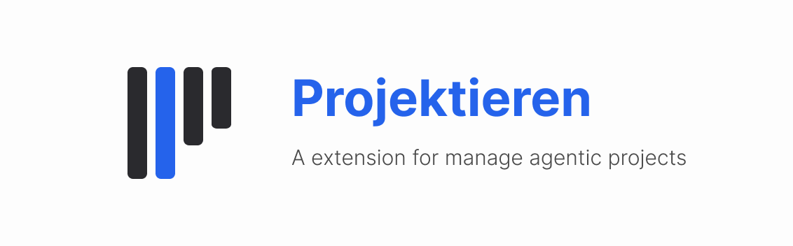
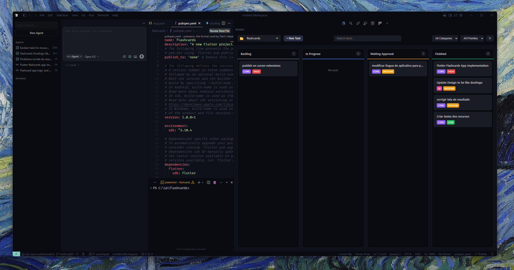

<p align="center">
  
</p>

<p align="center">
  <strong>A Extension for manage agentic projects</strong>
</p>

<p align="center">
  
</p>

A Visual Studio Code extension that provides a Kanban board for managing AI agent tasks in Cursor IDE. Get better visibility into what your AI agents are working on and track progress across multiple projects.

## 🎯 Purpose

When working with AI agents in Cursor, it can be challenging to:
- Track what tasks are being executed
- Maintain visibility across multiple features/projects
- Coordinate work between different agent sessions
- Keep a history of what was accomplished

**Projektieren** solves these problems by providing a visual task management system that integrates with Cursor's AI agents through MCP (Model Context Protocol).

## ✨ Features

### 📋 Visual Kanban Board
- **Four-column workflow**: Backlog → In Progress → Waiting Approval → Finished
- **Drag & drop** tasks between columns
- **Filter** by category (Core, UI, API) and priority (High, Medium, Low)
- **Search** tasks by title

### 🗂️ Multi-Project Support
- Separate task boards for each workspace/project
- Quick project switching via dropdown
- Tasks stored locally in each project's `.cursor-kanban/` folder

### 🤖 MCP Integration
- AI agents can create, update, and manage tasks via MCP tools
- Agents can mark tasks as in-progress and completed
- Full task context available to agents during execution

### 📝 Rich Task Management
- Title and detailed description
- Category classification (Core, UI, API)
- Priority levels (High, Medium, Low)
- Branch target configuration
- Task history tracking
- Run session logs

## ⚠️ Important Note

**Projektieren cannot communicate directly with the Cursor chat.** 

When you click the **▶ Play** button on a task:
1. The extension generates a detailed prompt with all task context
2. The prompt is **copied to your clipboard**
3. A notification appears with an option to open the chat
4. You then **paste the prompt into Cursor Chat** to start the agent

This workflow ensures the AI agent has full context about the task, including:
- Task ID for status updates
- Session ID for tracking
- Full description and requirements
- MCP commands for updating progress

## 🚀 Getting Started

### Installation

1. Build the extension:
```bash
pnpm install
pnpm run build
```

2. Install in VS Code/Cursor:
   - Open the Extensions view
   - Click "Install from VSIX..." 
   - Select the built `.vsix` file

### MCP Configuration

To enable AI agents to interact with Projektieren, add the MCP server to your Cursor configuration:

1. Run the command: `Kanban: Copy MCP Config`
2. Add the copied configuration to your `~/.cursor/mcp.json`:

```json
{
  "projektieren": {
    "command": "node",
    "args": ["/path/to/extension/dist/mcp/index.mjs", "--workspaceRoot", "/your/project/path"]
  }
}
```

## 📖 Usage

### Creating Tasks

1. Click **+ New Task** in the header
2. Fill in:
   - **Title**: Brief description of the task
   - **Description**: Detailed requirements
   - **Category**: Core, UI, or API
   - **Target Branch**: Current branch or create new
   - **Priority**: High, Medium, or Low
3. Click **Add Feature**

### Running Tasks with AI Agents

1. Click the **▶ Play** button on a backlog task
2. Choose branch target (current or new)
3. The agent prompt is copied to clipboard
4. Open Cursor Chat and paste the prompt
5. The agent will:
   - Call `kanban.startRun()` to mark as in-progress
   - Execute the task
   - Call `kanban.stopRun()` when complete

### MCP Tools Available to Agents

| Tool | Description |
|------|-------------|
| `kanban.listTasks` | List tasks with optional filters |
| `kanban.getTask` | Get full task details |
| `kanban.createTask` | Create a new task |
| `kanban.createTaskFromContext` | Create task from conversation context |
| `kanban.updateTask` | Update task properties |
| `kanban.updateStatus` | Change task status |
| `kanban.startRun` | Start working on a task |
| `kanban.stopRun` | Complete current session |
| `kanban.claimNextTask` | Get next available task |
| `kanban.addLog` | Add progress log to running task |

### Progress Logging

Agents can report progress during task execution using `kanban.addLog`:

```javascript
kanban.addLog({
  id: "task-id",
  sessionId: "session-id",
  message: "Implemented user authentication module",
  type: "milestone"  // progress | milestone | warning | error | info
})
```

Logs are displayed:
- **On cards**: Last 2 logs with icons and timestamps
- **In task details**: Full log history per session

## 🔄 Integration Possibilities

Projektieren can integrate with various workflows:

### CI/CD Integration
- Agents can create tasks from failed builds
- Mark tasks as complete when PRs are merged

### Project Management
- Sync with external tools via MCP
- Export task history for reporting

### Multi-Agent Workflows
- Queue tasks for sequential execution
- Different agents can claim and work on tasks
- Handoff between agents using status updates

### Custom Automations
- Create tasks from code comments (`// TODO:`)
- Auto-generate tasks from error logs
- Integration with issue trackers

## 📁 Project Structure

```
.cursor-kanban/
└── tasks.json          # Task storage (per project)

src/
├── core/
│   ├── TaskStore.ts    # Task data management
│   ├── gitHelper.ts    # Git operations
│   └── types.ts        # TypeScript types
├── mcp/
│   └── server.ts       # MCP server implementation
├── webview/
│   ├── components/     # React components
│   ├── App.tsx         # Main app component
│   └── styles.css      # Styling
├── extension.ts        # VS Code extension entry
└── webviewProvider.ts  # Webview management
```

## 🛠️ Development

```bash
# Install dependencies
pnpm install

# Build everything
pnpm run build

# Watch mode for development
pnpm run watch

# Build webview only
pnpm run build:webview

# Build MCP server only
pnpm run build:mcp
```

## 📄 License

MIT

## 🤝 Contributing

Contributions are welcome! Please feel free to submit issues and pull requests.

## 🎨 Theming

The Kanban board and logo automatically adapt to your VS Code theme:
- **Dark themes**: Light bars and blue accent text
- **Light themes**: Dark bars and blue accent text

The extension uses VS Code's CSS variables to seamlessly match your editor's appearance.

---

<p align="center">
  Built with ❤️ by william fabre
</p>
